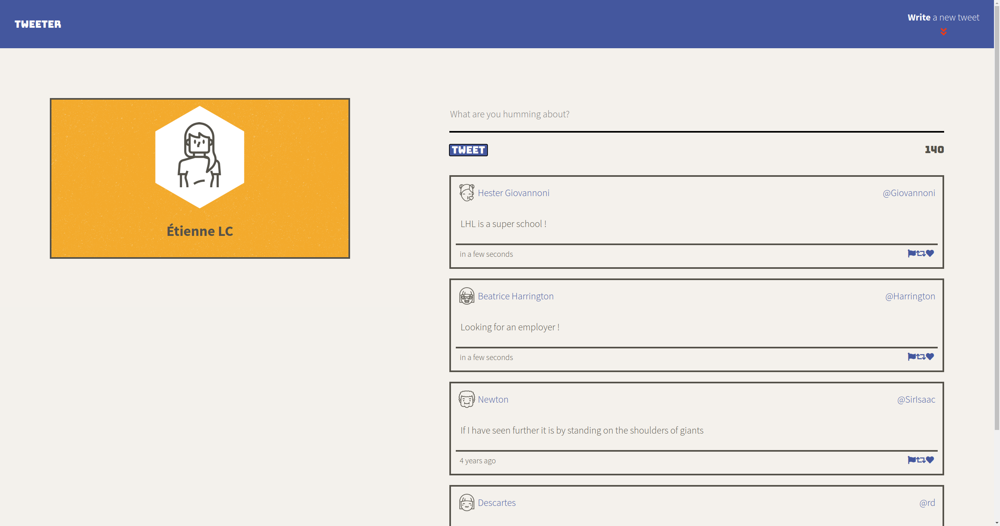
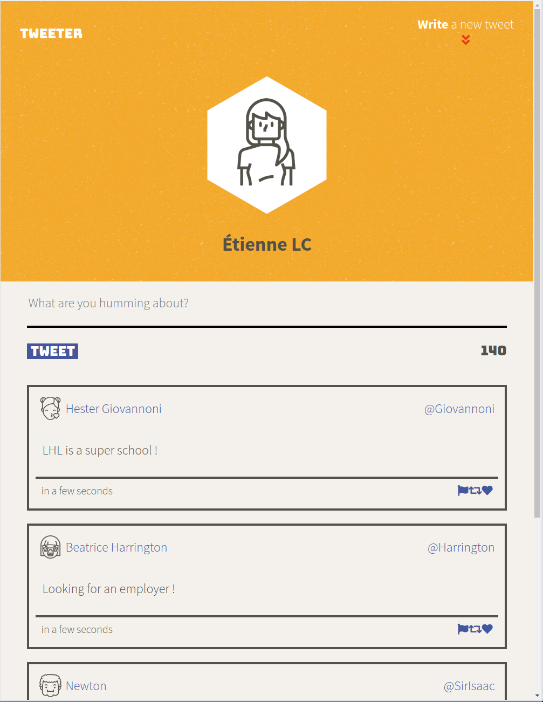

# Tweeter Project

Tweeter is a simple, single-page Twitter clone.

This repository is the starter code for the project: Students will fork and clone this repository, then build upon it to practice their HTML, CSS, JS, jQuery and AJAX front-end skills, and their Node, Express and MongoDB back-end skills.

### Stretch feature(s): 
- Event on click on "Write a new tweet" that hides/shows the textArea. When showing, activate the textArea to directly write a tweet.
- Used SCSS instead off plain CSS.

### Notes:
- Because I decided to only add the new tweet and not reload the entire tweets database on a new tweet submission, the date is not dynamic on old tweets.

## Getting Started

1. Fork this repository, then clone your fork of this repository.
2. Install dependencies using the `npm install` command.
3. Start the web server using the `npm run local` command. The app will be served at <http://localhost:8080/>.
4. Go to <http://localhost:8080/> in your browser.

## Dependencies

- Node 5.10.x or above
- "body-parser": "^1.15.2",
- "chance": "^1.0.2",
- "express": "^4.13.4",
- "md5": "^2.1.0"
- "sass": "^1.27.0"